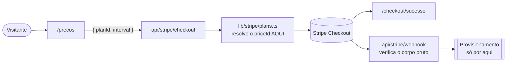

<p align="center">
  <picture>
    <source media="(prefers-color-scheme: dark)" srcset="public/imgs/logoCompletaBranca.svg"/>
    
  </picture>
</p>

<h2 align="center">Site Institucional</h2>

<p align="center">
  <strong>Plataforma SaaS de gestão inteligente de frotas</strong><br/>
  A porta de entrada do produto e o fluxo de assinatura. <em>A inteligência por trás de cada frota.</em>
</p>

<div data-importer="techs" align="center">
  <picture>
    <source media="(prefers-color-scheme: dark)" srcset="https://cdn.simpleicons.org/nextdotjs/FFFFFF"/>
    
  </picture>
  
  
  
  
  
  
  
  
  
  
  
  
</div>

---

## Sobre o projeto

Uma transportadora acompanha a operação em pedaços: rastreador num site, abastecimento numa
planilha, multas por e-mail, e o custo por quilômetro só no fechamento do mês, quando já não dá
para corrigir.

Este repositório é o **site público** que explica isso para quem ainda não é cliente, mostra os
planos e leva até a assinatura. Não é o painel. E a conversão termina em cobrança de verdade, pelo
Stripe.

| Projeto | O que é | Stack |
| ------- | ------- | ----- |
| **`Website-rookhub`** (este) | Site institucional e assinatura | Next.js 16 · App Router |
| [`../System-web`](../System-web) | Painel do cliente | Vite · React Router 8 |
| [`../System-mobile`](../System-mobile) | App do motorista | Expo · React Native |
| [`../Backend-web`](../Backend-web) | API | Java 21 · Spring Boot |

> ⚠️ Os quatro compartilham a **marca**, não o código. Convenção de um não vale no outro, e aqui
> várias são o oposto das dos irmãos. Ver [Convenções](#convenções).

**O que existe hoje:** quatro rotas públicas (`/`, `/precos`, `/checkout/sucesso`,
`/checkout/cancelado`), mais `sitemap.xml` e `robots.txt`. Os três Route Handlers do Stripe
funcionam, mas **só no build completo**: o site vai ao ar como export estático.

**Fora desta fase:** plataforma autenticada, CMS, blog, formulário de contato e analytics.

> **Fase atual: wireframe em escala de cinza**, para validar estrutura e texto sem a estética
> interferir na leitura. Nenhuma cor cromática entra enquanto durar. As exceções autorizadas estão
> em [`rules/04-design-system.md`](.claude/rules/04-design-system.md).

---

## Tecnologias utilizadas

| Categoria     | Ferramenta                                                                  | Versão            |
| ------------- | --------------------------------------------------------------------------- | ----------------- |
| Execução      | [Node.js LTS](https://nodejs.org/pt-br/download)                            | 20 LTS ou superior |
| Framework     | [Next.js](https://nextjs.org/) (App Router + Turbopack)                     | 16.3.2            |
| Biblioteca UI | [React](https://react.dev/)                                                 | 19.2.8            |
| Linguagem     | [TypeScript](https://www.typescriptlang.org/) (`strict`)                    | 5.x               |
| Estilização   | [Tailwind CSS](https://tailwindcss.com/) (CSS-first, `@theme`)              | 4.x               |
| Tema          | [next-themes](https://github.com/pacocoursey/next-themes)                   | 0.4.6             |
| Pagamentos    | [Stripe](https://stripe.com/) server + client                               | 22.5.0 / 9.14.0   |
| Utilidades    | [clsx](https://github.com/lukeed/clsx) + [tailwind-merge](https://github.com/dcastil/tailwind-merge) | 2.1.1 / 3.6.0 |
| Qualidade     | [ESLint](https://eslint.org/) (`eslint-config-next`)                        | 9.x               |

**npm, não pnpm:** projeto único, sem workspace. **Turbopack** é o padrão desde o Next 16, sem flag.

> ⚠️ **Não existe `tailwind.config.js`.** Na v4 a configuração é CSS: tokens no `@theme` de
> `src/app/globals.css`, e é ele que gera as utilities.

> ⚠️ **Não há Prettier nem suíte de testes aqui**, ao contrário do `System-web`.

---

## Estrutura do projeto

```
Website-rookhub/
├── .claude/              # Regras do projeto: fonte única de diretrizes
├── docs/                 # PRD, arquitetura e deploy
├── public/imgs/          # Logotipos e ícones
├── scripts/dev.mjs       # Envoltório do `next dev` (ver Convenções)
└── src/
    ├── app/              # App Router: só o que vira URL
    │   ├── (marketing)/  # → / e /precos. Os parênteses não entram na URL
    │   ├── checkout/     # → retorno do Stripe
    │   ├── api/stripe/   # checkout, portal e webhook (`route.api.ts`)
    │   ├── globals.css   # Tailwind v4, tokens e classes do projeto
    │   └── layout.tsx · robots.ts · sitemap.ts
    ├── components/       # ui · layout · marketing · pricing · checkout · theme
    ├── content/          # Conteúdo editorial tipado
    ├── lib/              # env, utils e stripe/
    └── types/            # Tipos de domínio
```

Normativo em [`rules/03-arquitetura.md`](.claude/rules/03-arquitetura.md). Resumo:

| O que você está escrevendo | Onde ele mora |
| -------------------------- | ------------- |
| Página institucional nova | `src/app/(marketing)/<rota>/`, e entra no `sitemap.ts` |
| Bloco de uma seção da landing | `src/components/marketing/` |
| Planos e cobrança | `src/components/pricing/` |
| Cabeçalho, rodapé, navegação | `src/components/layout/` |
| Primitivo reutilizável | `src/components/ui/` |
| **Texto, lista ou tabela de conteúdo** | `src/content/`, **nunca** dentro do JSX |
| Regra de negócio, integração, helper | `src/lib/` |
| Tipo usado por mais de um módulo | `src/types/` |
| Token, tipografia ou classe de seção | `src/app/globals.css` |
| Imagem ou logotipo | `public/imgs/` |
| Convenção nova do time | `.claude/rules/`, **nunca** só no README |

- **`app/` só tem roteamento.** Componente que não é rota não mora ali.
- **`content/` fica fora do componente.** Componente desenha, `content/` diz o quê: copy muda por
  decisão de produto, e dentro do JSX a troca aparece no diff como mudança de código.

⚠️ **Layout arquivado não é código morto.** `marketing/pillars-bento.tsx` e
`marketing/problem-solution-vs.tsx` seguem inteiros, cada um com cabeçalho dizendo como voltar a
ele. Varredura de importações acusa os dois como órfãos: leia o cabeçalho antes de apagar.

---

## Fluxo de assinatura

Quase tudo é **server component**. O JavaScript só vai ao navegador nas ilhas de interação: tema,
navegação móvel, abas e os botões de checkout.



> ⚠️ **O navegador nunca envia preço.** Aceitar um `priceId` vindo do cliente permitiria a qualquer
> visitante assinar qualquer Price da conta, inclusive um de R$ 0. E o provisionamento acontece
> **só pelo webhook**, nunca na página de sucesso.

Três planos (Básico, Profissional e Enterprise), cada um mensal e anual. Regras completas em
[`rules/05-stripe.md`](.claude/rules/05-stripe.md).

Para testar webhooks localmente, com chaves de **test mode** e o cartão `4242 4242 4242 4242`:

```bash
stripe listen --forward-to localhost:3000/api/stripe/webhook
stripe trigger checkout.session.completed
```

---

## Como executar

Requisitos: **Node.js 20 LTS ou superior** e npm.

```bash
git clone https://github.com/v2ntechnology/Website-rookhub.git
cd Website-rookhub
npm install
npm run dev
```

Acesse em [http://localhost:3000](http://localhost:3000). Sem `.env` o site sobe e navega
normalmente: só o checkout responde `503`, que é o esperado e não um defeito.

**Variáveis de ambiente:** o arquivo é o `.env` da raiz, e **nenhum é versionado, nem um de
exemplo**. A referência de quais existem é o próprio `.env`, que nasce com as chaves comentadas e a
explicação de cada uma. Peça o modelo ao time.

| Comando | Descrição |
| ------- | --------- |
| `npm run dev` | Desenvolvimento na porta 3000 |
| `npm run build` | Build completo, com as rotas do Stripe |
| `npm run build:static` | Export estático em `out/`, usado no deploy |
| `npm start` | Serve o build de produção |
| `npm run lint` | ESLint |
| `npm run typecheck` | `tsc --noEmit` |

---

## Build e deploy

Antes de abrir qualquer PR, os três precisam passar:

```bash
npm run lint && npm run typecheck && npm run build
```

O site vai ao ar como **export estático** na Cloudflare (`npm run build:static` gera `out/`).
Configuração do Worker em `wrangler.jsonc`, passo a passo em
[`docs/deploy-cloudflare.md`](docs/deploy-cloudflare.md).

⚠️ **No alvo estático nenhuma página pode depender de servidor.** Sem `cookies()`, sem
`searchParams` em Server Component, sem Server Action. Rota de metadado exporta
`dynamic = "force-static"`.

⚠️ **O checkout não existe no site publicado.** Os handlers se chamam `route.api.ts` porque essa
extensão só entra em `pageExtensions` no build completo: no estático fica de fora, já que
`output: "export"` não suporta POST. É o que permite os dois alvos conviverem no mesmo código.

⚠️ **`npm run build:static` não roda no Windows** (sintaxe Unix de variável). Para validar, definir
`BUILD_TARGET=static` pelo bash e chamar `./node_modules/.bin/next build`.

---

## Convenções

As regras completas estão em [`.claude/`](.claude/), que é a **fonte única** de diretrizes. Não crie
`.cursor/`, `.codex/` nem `.github/copilot-instructions.md`. Comece pelo
[`.claude/CLAUDE.md`](.claude/CLAUDE.md), que resume o operacional e aponta para as regras
numeradas.

O que mais surpreende quem chega, sobretudo vindo dos projetos irmãos:

- **Mensagem de commit é uma frase em pt-BR, sem prefixo** (`feat:`, `docs:` e afins não entram),
  igual aos outros três projetos. ⚠️ O histórico anterior a 29/08/2026 usa o formato antigo: não
  imite, e não reescreva.
- ⚠️ **Tipografia é classe própria**, não utilitário: use `.type-display-hero`, `.type-headline-md`
  e as outras. `text-4xl font-bold` quebra a escala e some com o responsivo.
- ⚠️ **A barra de rolagem é oculta** por decisão de projeto. O botão "voltar ao topo" existe para
  compensar a pista perdida.
- ⚠️ **A navegação são duas**, não uma barra adaptativa: ilhas flutuantes acima de `md`,
  `mobile-nav` abaixo. Mexeu em uma, confira a outra.
- ⚠️ **A raiz não tem `CLAUDE.md` nem `AGENTS.md`, e não deve voltar a ter.** O Next 16 os gera
  quando o `dev` roda dentro de um agente de IA, e não há como desligar. Por isso o `npm run dev`
  passa por `scripts/dev.mjs`, que limpa as variáveis que denunciam o agente. Chamar `next dev`
  direto recria os dois.
- Nenhum commit atribui autoria a IA. Cada pessoa configura a identidade com `--local`.
- Server Component é o padrão, exportação nomeada, sem `any`, e revisão nos **dois temas** e em
  360px antes de pedir review.

---

## Equipe

<table align="center">
  <tr>
    <td align="center" width="200">
      <a href="https://github.com/LucasDias777">
        
      </a>
      <br/><br/>
      <a href="https://github.com/LucasDias777">
        
      </a>
    </td>
    <td align="center" width="200">
      <a href="https://github.com/vinicim002">
        
      </a>
      <br/><br/>
      <a href="https://github.com/vinicim002">
        
      </a>
    </td>
    <td align="center" width="200">
      
      <br/><br/>
      
    </td>
  </tr>
</table>

---

<p align="center">
  Feito com dedicação pela equipe <strong>V2N Tech</strong>
</p>
