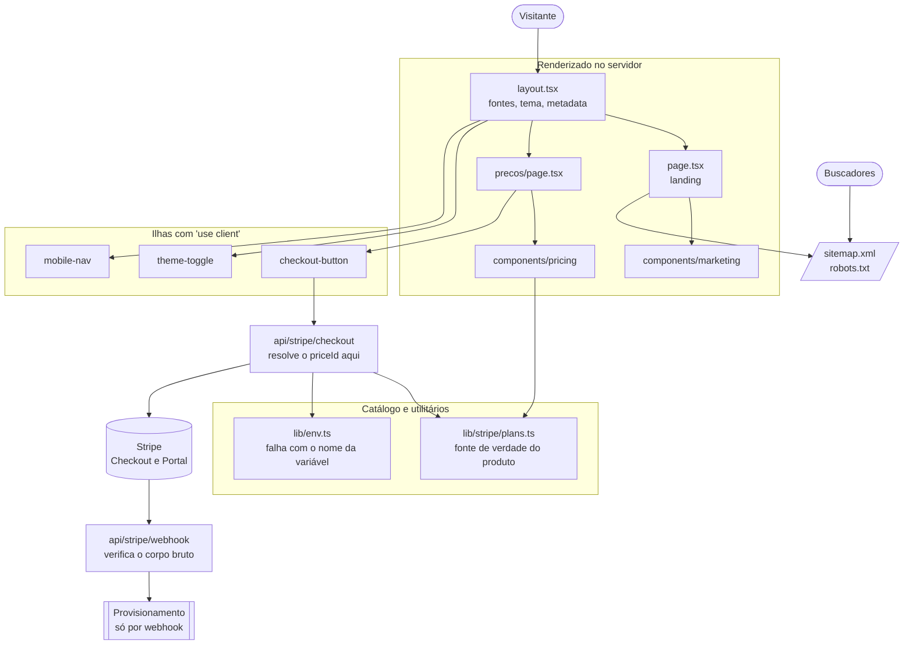

<p align="center">
  <picture>
    <source media="(prefers-color-scheme: dark)" srcset="public/imgs/logoCompletaBranca.svg"/>
    
  </picture>
</p>

<h2 align="center">Site Institucional</h2>

<p align="center">
  <strong>Plataforma SaaS de gestão inteligente de frotas</strong><br/>
  A porta de entrada do produto e o fluxo de assinatura. <em>A inteligência por trás de cada frota.</em>
</p>

<div data-importer="techs" align="center">
  <picture>
    <source media="(prefers-color-scheme: dark)" srcset="https://cdn.simpleicons.org/nextdotjs/FFFFFF"/>
    
  </picture>
  
  
  
  
  
  
  
  
  
  
  
  
</div>

---

## Sobre o projeto

### O problema

Uma transportadora rodoviária de carga acompanha sua operação em pedaços: o rastreador fica num
site, o abastecimento numa planilha, as multas chegam por e-mail e o custo por quilômetro só
aparece no fechamento do mês. Nesse ponto já não dá para corrigir.

Antes de resolver isso no produto, é preciso explicar o problema para quem ainda não é cliente. É
o que este repositório faz.

### A proposta

O **site público** do RookHub: apresenta o produto, mostra os planos e leva o visitante até a
assinatura. Não é o painel. Quem faz login, vê frota ou opera viagem está em outro projeto.

Aqui a conversão termina em cobrança de verdade: o visitante escolhe plano e intervalo, passa pelo
Stripe Checkout e a assinatura é provisionada por webhook.

### As três frentes do RookHub

| Projeto | O que é | Stack |
| ------- | ------- | ----- |
| **`Website-rookhub`** (este) | Site institucional e assinatura | Next.js 16 · App Router |
| [`../System-web`](../System-web) | Painel do cliente | Vite · React Router 8 |
| [`../System-mobile`](../System-mobile) | Painel e app do motorista | Monorepo pnpm · Expo |

> ⚠️ Os três compartilham a **marca**, não o código. Convenção de um não vale no outro: o
> `System-web` usa shadcn/ui e tokens OKLCH, aqui a configuração do Tailwind vive em CSS e a
> especificação de design é outra. Não importe padrão de um projeto para o outro sem conferir.

### O que existe hoje neste repositório

Quatro rotas públicas (`/`, `/precos`, `/checkout/sucesso`, `/checkout/cancelado`), mais
`sitemap.xml` e `robots.txt` gerados pelo Next. Os três Route Handlers do Stripe (checkout,
portal e webhook) existem e funcionam, mas **só no build completo**: hoje o site vai ao ar como
export estático.

O que **não** faz parte desta fase: plataforma autenticada de gestão de frota, CMS, blog,
formulário de contato e analytics.

> **Fase atual: wireframe em escala de cinza.** O site está deliberadamente reduzido a um
> protótipo de baixa fidelidade, para validar estrutura de seções, hierarquia e texto sem que a
> estética interfira na leitura. Nenhuma cor cromática entra enquanto isso durar. Detalhes e as
> exceções autorizadas estão em [`.claude/rules/04-design-system.md`](.claude/rules/04-design-system.md).

### Destaques

- **Renderização no servidor por padrão**: `"use client"` só onde há estado ou evento de navegador
- Assinatura recorrente completa: Checkout Session, Customer Portal e webhook verificado
- **O navegador nunca envia preço.** Ele manda o identificador do plano, e o servidor resolve o
  `priceId`. Aceitar preço do cliente permitiria assinar qualquer valor da conta Stripe
- Dois alvos de build a partir do mesmo código: completo com servidor, e export estático
- SEO com `metadata` por rota, `sitemap.ts` e `robots.ts`
- Tema claro e escuro por classe, com as duas famílias tipográficas auto-hospedadas

---

## Tecnologias utilizadas

| Categoria     | Ferramenta                                                                  | Versão            |
| ------------- | --------------------------------------------------------------------------- | ----------------- |
| Execução      | [Node.js LTS](https://nodejs.org/pt-br/download)                            | 20 LTS ou superior |
| Gerenciador   | npm                                                                          | 10+               |
| Framework     | [Next.js](https://nextjs.org/) (App Router + Turbopack)                     | 16.3.2            |
| Biblioteca UI | [React](https://react.dev/)                                                 | 19.2.8            |
| Linguagem     | [TypeScript](https://www.typescriptlang.org/) (`strict`)                    | 5.x               |
| Estilização   | [Tailwind CSS](https://tailwindcss.com/) (CSS-first, `@theme`)              | 4.x               |
| Tema          | [next-themes](https://github.com/pacocoursey/next-themes) (estratégia de classe) | 0.4.6        |
| Pagamentos    | [Stripe](https://stripe.com/) server + [stripe-js](https://github.com/stripe/stripe-js) client | 22.5.0 / 9.14.0 |
| Utilidades    | [clsx](https://github.com/lukeed/clsx) + [tailwind-merge](https://github.com/dcastil/tailwind-merge) (helper `cn`) | 2.1.1 / 3.6.0 |
| Qualidade     | [ESLint](https://eslint.org/) (flat config, `eslint-config-next`)           | 9.x / 16.3.2      |

**Por que npm e não pnpm:** este é um projeto único, sem workspace. O pnpm só é obrigatório no
`../System-mobile`, onde o Metro do React Native depende do layout de `node_modules` dele.

**Turbopack é o padrão** desde o Next 16, em `dev` e em `build`, sem precisar de flag.

> ⚠️ **Não existe `tailwind.config.js`.** Na v4 a configuração é CSS: os tokens ficam no `@theme`
> de `src/app/globals.css` e é ele que gera as utilities.

> ⚠️ **Não há Prettier nem suíte de testes neste projeto**, ao contrário do `System-web`. A
> verificação antes do PR são os três comandos da seção [Build de produção](#build-de-produção).

---

## Estrutura do projeto

```
Website-rookhub/
├── .claude/                      # Regras do projeto: FONTE ÚNICA de diretrizes
│   ├── CLAUDE.md                 # Índice e regras inegociáveis
│   ├── design/DESIGN.md          # Especificação de origem do design system (normativa)
│   └── rules/                    # 01 stack · 02 commits · 03 arquitetura
│                                 # 04 design · 05 stripe · 06 seo
├── docs/                         # PRD, arquiteturas e especificações de produto
│   └── deploy-cloudflare.md      # Como o export estático vai ao ar
├── public/
│   ├── imgs/                     # Logotipos e ícones servidos como estáticos
│   └── wireframe/                # Referência estática do wireframe validado
├── src/
│   ├── app/                      # App Router: só o que vira URL mora aqui
│   │   ├── layout.tsx            # Shell raiz: fontes, tema, metadata base
│   │   ├── page.tsx              → /
│   │   ├── globals.css           # Tailwind v4 e os design tokens
│   │   ├── icon.svg              # Ícone da aba
│   │   ├── precos/               → /precos
│   │   ├── checkout/             → /checkout/sucesso e /checkout/cancelado
│   │   ├── api/stripe/           # checkout, portal e webhook (route.api.ts)
│   │   ├── robots.ts             → /robots.txt
│   │   └── sitemap.ts            → /sitemap.xml
│   ├── components/
│   │   ├── ui/                   # Primitivos: button, card, section, reveal
│   │   ├── layout/               # Cabeçalho, rodapé, navegação móvel, voltar ao topo
│   │   ├── marketing/            # Blocos da landing: hero, pilares, perfis, CTA
│   │   ├── pricing/              # Tabela de planos, comparativo, prova social, checkout
│   │   ├── checkout/             # Retorno do Stripe (client)
│   │   └── theme/                # Provider e alternador de tema
│   ├── lib/
│   │   ├── env.ts                # Leitura das variáveis, com falha explícita
│   │   ├── utils.ts              # Helper `cn`
│   │   └── stripe/               # server.ts (SDK server-only) e plans.ts (catálogo)
│   └── types/                    # Tipos de domínio compartilhados
├── eslint.config.mjs
├── next.config.ts
├── postcss.config.mjs
├── tsconfig.json
├── wrangler.jsonc                # Cloudflare Workers Static Assets
└── package.json
```

### Onde cada arquivo deve ficar

A regra normativa é [`.claude/rules/03-arquitetura.md`](.claude/rules/03-arquitetura.md). O resumo
prático:

| O que você está escrevendo | Onde ele mora |
| -------------------------- | ------------- |
| Rota nova | `src/app/<rota>/page.tsx`, e entra no `sitemap.ts` |
| Bloco de uma seção da landing | `src/components/marketing/` |
| Qualquer coisa de planos e cobrança | `src/components/pricing/` |
| Cabeçalho, rodapé, navegação | `src/components/layout/` |
| Primitivo reutilizável por qualquer tela | `src/components/ui/` |
| Regra de negócio, integração, helper | `src/lib/` |
| Tipo usado por mais de um módulo | `src/types/` |
| Token de cor, fonte ou raio | `@theme` em `src/app/globals.css` |
| Imagem ou logotipo | `public/imgs/` |
| Convenção nova do time | `.claude/rules/`, **nunca** só no README |

**Por que `app/` só tem roteamento:** o que está em `src/app` vira URL. Componente que não é rota
não mora ali, senão o mapa de rotas do projeto deixa de ser legível de relance.

**Por que os handlers do Stripe se chamam `route.api.ts`:** essa extensão só entra em
`pageExtensions` no build completo. No export estático ela fica de fora, porque `output: "export"`
não suporta POST nem leitura do request. É o que permite os dois alvos conviverem no mesmo código.

**Por que `.claude/` e não `docs/` para as regras:** `docs/` guarda especificação de produto (PRD,
arquitetura, app do motorista). `.claude/` guarda como se escreve código aqui. São públicos
diferentes, e misturar os dois faz ninguém ler nenhum.

---

## Arquitetura

Quase tudo é **server component**: a página lê o catálogo tipado de `src/lib/stripe/plans.ts` no
servidor e manda HTML pronto. O JavaScript só vai para o navegador nas ilhas de interação, que são
o alternador de tema, a navegação móvel e os botões de checkout.



---

## Fluxo de assinatura

1. O visitante escolhe plano e intervalo em `/precos`.
2. O navegador chama `POST /api/stripe/checkout` enviando **apenas** `{ planId, interval }`.
3. O servidor resolve o `priceId` correspondente e cria a Checkout Session.
4. O Stripe redireciona para `/checkout/sucesso` ou `/checkout/cancelado`.
5. O provisionamento acontece **exclusivamente pelo webhook**, nunca na página de sucesso.

> **Por que o navegador não envia o `priceId`:** aceitar um preço vindo do cliente permitiria a
> qualquer visitante assinar qualquer Price da conta Stripe, inclusive um de R$ 0. O identificador
> do plano é traduzido para preço no servidor, em `src/lib/stripe/plans.ts`.

O catálogo tem três planos (Básico, Profissional e Enterprise), cada um com preço mensal e anual.
Regras completas em [`.claude/rules/05-stripe.md`](.claude/rules/05-stripe.md).

### Testando webhooks localmente

```bash
stripe login
stripe listen --forward-to localhost:3000/api/stripe/webhook
stripe trigger checkout.session.completed
```

Use sempre chaves de **test mode** em desenvolvimento. Cartão de teste: `4242 4242 4242 4242`.

---

## Como executar

### Pré-requisitos

| Ferramenta | Versão   | Download                          |
| ---------- | -------- | --------------------------------- |
| Node.js    | 20 LTS+  | https://nodejs.org/pt-br/download |
| npm        | 10+      | Incluído com o Node.js            |
| Git        | qualquer | https://git-scm.com/downloads/win |

### Passos

```bash
# 1. Clonar o repositório
git clone https://github.com/v2ntechnology/Website-rookhub.git
cd Website-rookhub

# 2. Instalar dependências
npm install

# 3. Criar o arquivo de ambiente a partir do exemplo
cp .env.example .env.local

# 4. Rodar em ambiente de desenvolvimento
npm run dev
```

Acesse em [http://localhost:3000](http://localhost:3000).

Sem as chaves do Stripe o site sobe e navega normalmente: só o checkout responde `503`, que é o
comportamento esperado e não um defeito.

### Variáveis de ambiente

O contrato vive em `.env.example`, versionado. O arquivo real é o `.env.local`, **nunca
commitado**. Mudou o contrato? Atualize o exemplo na mesma branch.

| Variável | Escopo | Para quê |
| -------- | ------ | -------- |
| `NEXT_PUBLIC_SITE_URL` | público | URL absoluta; base do `sitemap`, do OG e do retorno do Stripe |
| `STRIPE_SECRET_KEY` | servidor | Chave secreta (`sk_…`), nunca exposta ao navegador |
| `STRIPE_WEBHOOK_SECRET` | servidor | Segredo de verificação do webhook (`whsec_…`) |
| `NEXT_PUBLIC_STRIPE_PRICE_<PLANO>_<INTERVALO>` | público | ID do Price de cada plano |

São **seis** Price IDs: `STARTER`, `PRO` e `ENTERPRISE`, cada um em `MONTHLY` e `YEARLY`.

⚠️ **Só `NEXT_PUBLIC_*` chega ao navegador.** Nada sigiloso pode usar esse prefixo. As variáveis
públicas são referenciadas **literalmente** em `src/lib/env.ts`, e não por índice dinâmico, porque
o Next as substitui estaticamente no bundle: `process.env[nome]` não funcionaria no cliente.

Variável de servidor ausente derruba a chamada com o nome dela na mensagem, em vez de falhar
silenciosamente mais adiante.

### Scripts disponíveis

| Comando                | Descrição                                            |
| ---------------------- | ---------------------------------------------------- |
| `npm run dev`          | Servidor de desenvolvimento (porta 3000)             |
| `npm run build`        | Build completo: SSR e Route Handlers do Stripe       |
| `npm run build:static` | Export estático em `out/`, usado no deploy           |
| `npm start`            | Serve o build de produção para validação             |
| `npm run lint`         | Análise estática (ESLint)                            |
| `npm run typecheck`    | Verifica os tipos sem emitir arquivos                |

---

## Build de produção

Antes de abrir qualquer PR, os três comandos precisam passar:

```bash
npm run lint && npm run typecheck && npm run build
```

### Deploy

O site institucional vai ao ar como **export estático** na Cloudflare, sem servidor. Decisão de
produto: só o institucional é publicado por enquanto.

```bash
npm run build:static   # gera out/
```

A configuração do Worker está em `wrangler.jsonc` (projeto `rookhub-site`) e o passo a passo em
[`docs/deploy-cloudflare.md`](docs/deploy-cloudflare.md).

⚠️ **No alvo estático nenhuma página pode depender de servidor.** Sem `cookies()`, sem
`searchParams` em Server Component e sem Server Action. `searchParams` só via `useSearchParams()`
em Client Component dentro de `<Suspense>`. As rotas de metadado exportam `dynamic = "force-static"`.

⚠️ **O checkout não existe no site publicado**, porque as rotas `/api/stripe/*` ficam fora do
export. Ele volta quando o app rodar com servidor.

---

## Design system

A especificação de origem está em [`.claude/design/DESIGN.md`](.claude/design/DESIGN.md) e as
decisões de implementação em [`.claude/rules/04-design-system.md`](.claude/rules/04-design-system.md).
Os dois não podem divergir: mudou um, atualize o outro na mesma branch.

A identidade alvo é **Total Glassmorphism**, painéis translúcidos sobre um vazio escuro, com
profundidade comunicada por translucidez e não por sombra. Ela está **suspensa** durante a fase de
wireframe descrita acima, e continua normativa para a reaplicação depois da validação de conteúdo.

Dois pontos que valem para quando a marca voltar:

- O indigo de preenchimento é `#5457EE`, e não o `#6366F1` da especificação. O original reprova AA
  com texto branco por margem mínima (4.47:1). O `#6366F1` segue reservado a glows e indicadores,
  onde nunca há texto por cima.
- Superfície de vidro tem orçamento: `backdrop-filter` recompõe a cada frame, então o teto é de
  cerca de 6 superfícies simultâneas no viewport. Esse limite prevalece sobre a estética.

⚠️ **Nunca escreva um hex solto num componente.** Use os tokens do `@theme` em
`src/app/globals.css`.

---

## Convenções

As regras completas estão em [`.claude/`](.claude/), que é a **fonte única** de diretrizes. Não
crie `.cursor/`, `.codex/` nem `.github/copilot-instructions.md`. O `CLAUDE.md` da raiz é só um
ponteiro, e o `AGENTS.md` é gerado pelo `next dev` e deve ser commitado como veio.

O essencial:

- Arquivos em `kebab-case.tsx`, componentes em `PascalCase`, **exportação nomeada**. `export
  default` só em `src/app/`, porque o App Router exige.
- **Server Component é o padrão.** `"use client"` só com estado, efeito, evento ou API de
  navegador, e sempre empurrado para a folha da árvore.
- TypeScript estrito: sem `any`, sem `@ts-ignore`, sem `!` para calar o compilador. Precisa de
  escape? `unknown` com narrowing explícito.
- No Next 16 as Request APIs são assíncronas: `headers()`, `cookies()`, `params` e `searchParams`
  retornam `Promise`. E `middleware.ts` virou `proxy.ts`.
- Classes utilitárias sempre via `cn()`, para quem consome poder sobrescrever.
- **Rota nova entra no `sitemap.ts`**, que não descobre sozinho, e recebe `metadata` própria.
- Revise a mudança nos **dois temas** e em viewport móvel de 360px.

⚠️ **Consulte `node_modules/next/dist/docs/` antes de assumir qualquer API do Next.** Esta é a v16
e a documentação empacotada tem precedência sobre memória prévia.

---

## Segurança

- `STRIPE_SECRET_KEY` e `STRIPE_WEBHOOK_SECRET` vivem apenas no servidor. Marque módulos sensíveis
  com `import "server-only"`.
- **Nunca confie em preço vindo do navegador.** Veja a seção Fluxo de assinatura.
- O webhook verifica a assinatura com o corpo **bruto** (`await request.text()`). Nunca faça
  `request.json()` antes de verificar, porque isso invalida a checagem.
- O handler de webhook é **idempotente**: o Stripe reentrega eventos, então registre o `event.id`
  antes de aplicar efeito colateral.
- Route Handler devolve mensagem de erro genérica ao cliente; o detalhe vai para o log do servidor.
- Nenhum arquivo de ambiente é versionado, com a exceção do `.env.example`, que não tem valores.

---

## Git

- Repositório oficial: `https://github.com/v2ntechnology/Website-rookhub.git`
- **Conventional Commits é obrigatório aqui**: `feat:`, `fix:`, `refactor:`, `docs:`, `chore:`.
  ⚠️ Isso é o **oposto** da convenção do `../System-web`, que proíbe o prefixo. A regra vale por
  repositório, e a deste é a [`.claude/rules/02-commits-e-branches.md`](.claude/rules/02-commits-e-branches.md).
- **Nunca commite direto na `main`.** Trabalhe em `feat/*`, `fix/*` ou `chore/*` e abra PR.
- Nenhum commit pode atribuir autoria a IA, em autor, committer ou qualquer trailer. A autoria é
  dos desenvolvedores. Citar a pasta `.claude/` no corpo não é violação.
- Não usar `--force`, `reset --hard` ou reescrita de histórico.
- Cada pessoa configura a **própria identidade** com `--local`, para não alterar o Git global:

```bash
git config --local user.name "Seu Nome"
git config --local user.email "seu.email@exemplo.com"
```

---

## Equipe

<table align="center">
  <tr>
    <td align="center" width="200">
      <a href="https://github.com/LucasDias777">
        
      </a>
      <br/><br/>
      <a href="https://github.com/LucasDias777">
        
      </a>
    </td>
    <td align="center" width="200">
      <a href="https://github.com/vinicim002">
        
      </a>
      <br/><br/>
      <a href="https://github.com/vinicim002">
        
      </a>
    </td>
    <td align="center" width="200">
      
      <br/><br/>
      
    </td>
  </tr>
</table>

---

<p align="center">
  Feito com dedicação pela equipe <strong>V2N Tech</strong>
</p>
